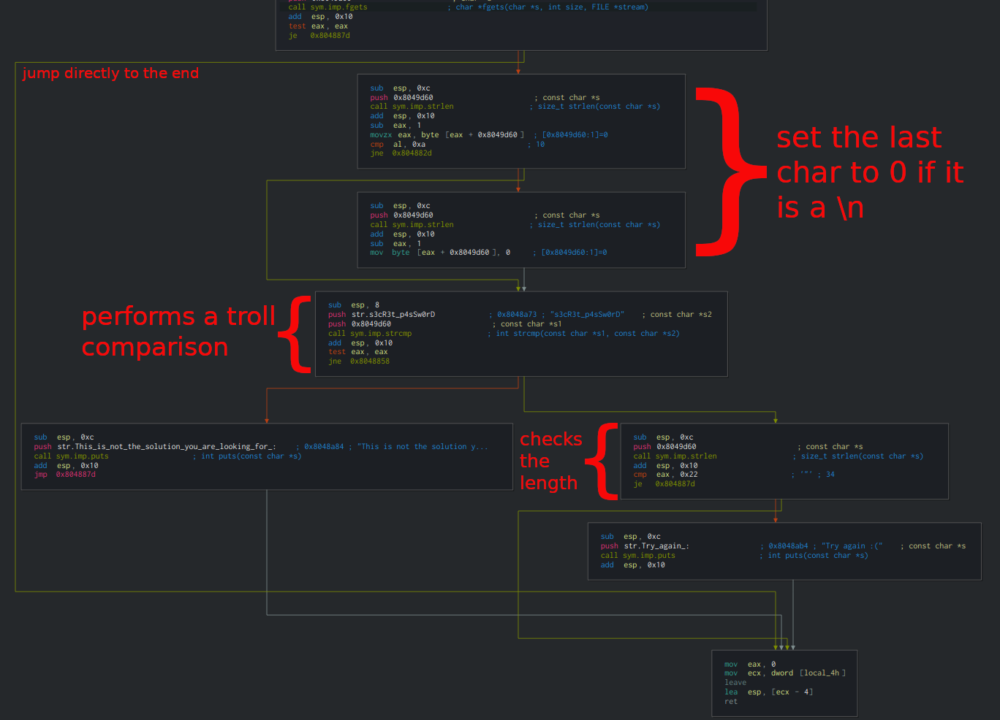

# Various approaches to automate to a reversing challenge

## **Introduction**
In this writeup I will introduce different approaches to a simple reverse engineering challenge, using different tools, and by producing scripts to automate the process.

This tutorial is recommended for people that do not know much about automating a reversing challenge, but they know something about reversing engineering in general.
The scripts I will show you, are only introductive.

The challenge I am going to describe is taken from the practice challenges of the [Reply Cyber Security Challenge](https://challenges.reply.com).
The challenge name is ***wysiNwyg***, and I decided to use this one because it is quite easy to automate.

The tools I'm going to introduce are:
- [Cutter](https://github.com/radareorg/cutter) (for static analysis)
- [gdb](https://www.gnu.org/software/gdb/)
- [gdb-peda](https://github.com/longld/peda)/[gdb-gef](https://github.com/hugsy/gef)
- [R2pipe](https://github.com/radare/radare2-r2pipe)

## **Binary Analysis**
First of all, we try to run strings to see if there is something readable and useful inside the binary:
```
$ strings ./wysiNwyg
...
ptrace
...
No debugger please!
#########################################################
### Welcome to the "wysiNwyg" challenge!
###     Your task is to find out the password to be able
###     to decrypt the password-protected zip and read
###     the secret flag. Good Luck!!
#########################################################
Password: 
s3cR3t_p4sSw0rD
This is not the solution you are looking for :)
Try again :(
...
```

All right!! We just discovered that there is a call to **ptrace**, and it looks like that the challenge doesn't want to be debugged ([why using ptrace?](https://www.aldeid.com/wiki/Ptrace-anti-debugging)).
Now we can open ***Cutter*** and start to uncover what this binary does.

One of the first things we may notice is that there are 2 .init and 2 .fini [functions](http://l4u-00.jinr.ru/usoft/WWW/www_debian.org/Documentation/elf/node3.html)


Another thing to notice is that the entry4.fini is much bigger than any other function.

But let's start to see what they do.
The first one doesn't seem to do anything significant, so we start looking at entry2.init:


OK! We found where the ptrace is called, now we can patch the binary using... the power of Cutter 😎


Now we can start to analyze the main function.
It's easy to see that, after the welcome message and the 'Password: ' string, there is a *fgets* that takes at most **35** chars in input and stores them at ```0x8049d60```.


To better understand the flow of the function I decided to use the **graph view**:


It seems that the first thing it does is checking if the input is empty: in that case, it jumps directly to the end. 
Otherwise, it continues by removing the last char if is a '\n' and it compares the string with "*s3cR3t_p4sSw0rD*", but this comparison is only a troll.. 
The last check contained inside the main function is the length of the input string, which is 34 length chars (0x22). 
It prints "*Try again :(*" if the condition is not met.

Good, now we know that the program wants a 34 length string, but which one?
Let's analyze the other .fini functions.
I'll skip the entry3.fini function because it won't lead to anything important (but I suggest you to have a look at it and understand why it is not useful).

On the contrary, entry4.fini is the function we are looking for. 
First, after a declaration of many variables (that we skip at the moment), it checks again if the input string is 34 char length, and then it starts diving into a loop.
Excellent! This is where we can find our answer!
With graph view, we can easily see that the cycle will end either if the program has done 34 cycles (from 0 to 33, included) or if it misses a comparison.


Here the program takes each char of our string, it applies the xor function with the value 51 (0x33) and it compares them with another string.
So what we need to do now is to add a breakpoint at the address of the compare, take the value inside edx, xor it with 51 and finally reconstruct the password.
If the program exits correctly from the cycle, the program flows inside another while loop where I guess (because of the ```call sym.imp.putchar```) it will print a congratulation message.
But...do we want to do it by hand?

## **Time to script!**
Just to recap, the program asks for a password that is 34 char long.
The address where the program performs the comparison char by char is ```0x0804872e```.

I want to code a script that breaks at ```0x0804872e```, picks the value of edx (and possibly xor it with 51) and set eax = edx, so that it can successfully pass the compare and let the program continue the cycle.

### GDB
To run a GDB script we need to write all the commands in a file and load it by running gdb with ```-x filename``` option.

Breakpoints can be set before the list of commands, and you can also set variables if you need them.

My solution to the challenge using GDB is the following:
```
#gdb -silent -x ./gdbinit ./wysiNwyg    # command to run gdb using this script

b* 0x0804872e                   # put a breakpoint at the compare
commands                        # start list of the list of commands to do

p/x $edx^51                     # print the hex value of edx^51
set $eax = $edx                 # set eax = edx so that it can pass the compare
continue                        # continue the execution, it will hit the breakpoint 34 times
end                             # end of list of commands

run                             # start the execution
```

Remember to input a random string which has length >= 34: if it's shorter, it will end before the comparison.
On the other hand, the fgets accept the first 35 char (with the \n), hence all the strings longer than the fixed bound will be truncated.

The output of this script isthe list of all values in edx:
```
$1 = 0x2
$2 = 0x5d
...
$32 = 0x6a
$33 = 0x12
$34 = 0x12
Congratulations! You just won :p
```
Ok, we managed to win.. but... the password?
We have two options: we write a program that takes that values and reconstruct the string or we simply let gdb do the same for us!
Instead of doing ```p/x $edx^51```, I opted to use the printf:

```printf "%c", ($edx^51)```

Run gdb again and:
```
...
1n1T_4nD_F1n1_4rR4Ys_4r3_S0_34sY!!Congratulations! You just won :p
...
```

We got it!!!

These two examples were only to introduce you to scripting, in fact, if we use some extension to GDB this challenge could be easily solved.
Below I will show my solutions using GDB-peda (with ```xormem```) and GDB-gef (with ```xor-memory```)

#### GDB-peda
While I was analyzing the entry4.fini function, I skipped the declaration of many variables, as they were probably the encrypted password and congratulation message.
With the following scripts, I want to decrypt them directly from the memory.

Unfortunately, for an unknown reason, we can't put a number as key, so we have to append a char so that it didn't "think" it is a number...
I decided to xor the chars in even positions, and then those who are in odd one:
```
source ~/peda/peda.py

#set a breakpoint immediately after the declaration of the variables
b* 0x080486e9

commands

xormem $ebp-0x50 $ebp-0x0d "\x33\x00"   # xor chars in an even position
xormem $ebp-0x50 $ebp-0x0d "\x00\x33"   # xor chars in an odd position

# print the result as string
x/s $ebp-0x50

continue
end
run
```

#### GDB-gef
The same script for GDB-gef is instead:
```
source ~/gef/gef.py

#set a breakpoint immediately after the declaration of the variable
b* 0x080486e9

commands

xor-memory display $ebp-0x50 67 "\x33"

continue
end
run
```

Don't forget to do ```help [command]``` if you don't know what a command does!

For a cheatsheet of GDB-peda's commands see [here](https://github.com/stmerry/gdb-peda-cheatsheet/blob/master/gdb-peda%20cheatsheet.pdf).

For a cheatsheet of GDB-gef's commands see [here](https://github.com/zxgio/gdb_gef-cheatsheet/blob/master/gdb_gef-cheatsheet.pdf).

### R2pipe
R2pipe is a powerful tool that let you invoke radare2 commands using Python.
It creates a 'pipe' that sends commands and receives the result.

I used also rarun2 to redirect I/O to another terminal (an easy and useful guide on how to do is [here](https://reverseengineering.stackexchange.com/questions/16428/debugging-with-radare2-using-two-terminals)).

First, in our R2pipe scripts, we need to load the binary with ```r2pipe.open()```: it takes as arguments the path to binary to load and the list of options for settings up radare2. 
The method returns an object "connected" with radare2.

All the commands we want to send to radare2 has to be invoked with the ```cmd``` method of the object or, if we want a result parsed in JSON, with ```cmdj```.

The script I made for this presentation is the following:
```
#python R2p.py 2> /dev/null                         # command to run without showing 

import r2pipe
l = ['-d', '-e', 'dbg.profile=t.rr2']
p = r2pipe.open('./wysiNwyg', l)                    # load the binary using
s = ''
p.cmd("db 0x0804872e")                              # set a breakpoint at the compare
for i in range(34):
  p.cmd("dc");                                      # "debug continue", it will run until hit a breakpoint or it ends
  try:                                              # if it can't get the registers values it will throw an exception
    edx = p.cmdj("drj")['edx']                      # drj returns a json of the register's values,
                                                    # and I need only edx
  except:
    break
  p.cmd("dr eax=edx")                               # set eax = edx so it can pass the compare
  s += chr(edx^0x33)                                # reconstract the password
  
print s                                             # print us the password
```
As said before, each random string with length >= 34 is ok.


Thanks to [*@zangobot*](https://github.com/zangobot) for helping me to write this file
